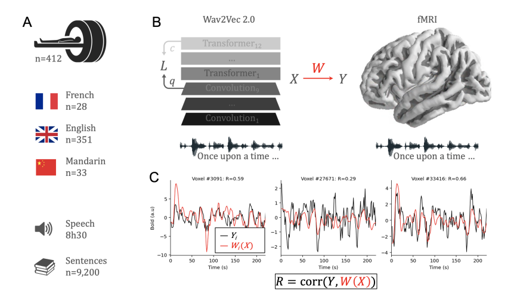
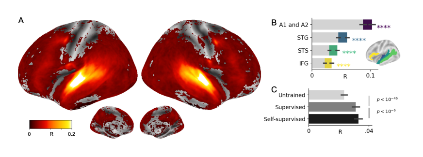
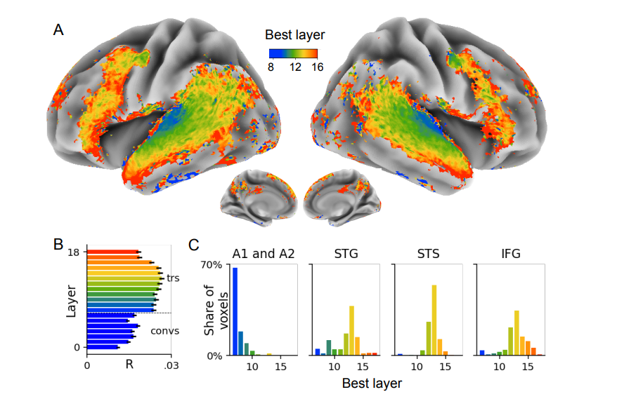
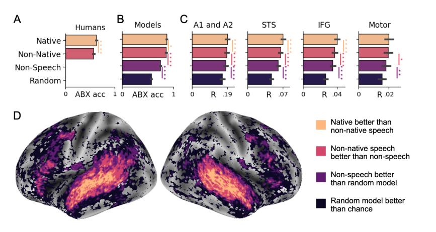

# Toward a realistic model of speech processing in the brain with self-supervised learning

Recent research has found that deep neural networks can produce similar results to the brain in response to the same input. However, these algorithms have certain limitations, such as 
1. requiring a large amount of data 
2. supervised labels
3. textual input rather than raw sensory input
4. large memory

To address these challenges in speech processing, we propose utilizing self-supervised algorithms that are trained on raw waveform data. Our research demonstrates that this approach can create brain-like representations with just 600 hours of unlabeled speech, a similar exposure rate to that of infants during language acquisition. The functional hierarchy of this algorithm aligns with the cortical hierarchy of speech processing, and various training methods reveal functional specialization that is comparable to the cortex. Our research confirms that this specialization is analogous to the behavior of additional participants.

Furthermore, we showcase how self-supervised learning can explicate the organization of speech processing in the brain and identify the language acquisition laws that shape the human brain

### Comparison of speech representations in brains and deep neural networks.
We test our hypothesis that the latest self-supervised architecture (wav2vec 2.0 in our case) trained on raw sensory data can produce activations similar to brain activity.

     
    <em>Figure 1: Comparing speech representations in brain and deep neural networks</em>

**Part A**: We recorded brain activity of 412 participants using functional Magnetic Resonance Imaging (fMRI) as they passively listened to audio books in their native language (English, French or Mandarin)

**Part B**: We take the activations X of the self-supervised wav2vec 2.0 model trained on 600 hrs of unlabelled data and the brain activity Y. We then measure the similarity between X and Y using standard encoding model W and evaluated using cross-validated Pearson correlation R.

**Part C**: We observe that the true BOLD (blood oxygen level-dependent) response (black) and the predicted BOLD reponse (red) from our model are quite similar indicating that the representations learned by our model are closer to brain-like representations.

**Key Takeaway**: We map the activations obtained from the trained wav2vec 2.0 model to the brain activity and measure the similarity using Pearson correlation R (higher is better).

### Can brain-like representations be generated using self supervised modeling?
We compare three different models. An untrained wav2vec 2.0 model, a model train with a self-supervised objective, and a supervised model trained using phonetic prediction from the same 600h of speech.

     
    <em>Figure 2: Self-supervised learning for wav2vec 2.0 is enough to generate brain-like representations</em>

**Part A**: Brain score R is calculated for each participant and voxel independently. Here we show the average scores across subjects using color coding. 

**Part B**: Shows the R scores for the same wav2vec 2.0 model, averaged across subjects and voxels in four brain areas typically involved in speech processing. The gray bar shows the brain score obtained with randomly initialized wav2vec 2.0 model, while the colored bars represent the scores obtained with the trained model. We observe that there is a significant difference between the random and the trained model indicating that the trained model is actually learning the brain-like representations.

**Part C**: We compare unsupervised, supervised, and self supervised trained models on 600 hrs of effective speech using R scores. We observe that self supervised model better corresponds to generating brain-like representations.

**Key Takeaway**: Brain activity in nearly all cortical areas can be predicted with significant accuracy based on the activations of the models. Self-supervision performs better than supervised.

### Is there a mapping between the functional hierarchy of the self-supervised models and the speech hierarchy of the brain?
Next, we try mapping the functional hierarchy (model layers) of our self-supervised model with that of the speech hierarchy (speech related regions of brain i.e A1, A2, STG, STS, and IFG).

     
    <em>Figure 3: The functional hierarchy of self-supervised wav2vec 2.0 maps to the speech hierarchy of the brain</em>

**Part A**: We compute the R scores for each layer of the wav2vec 2.0 model separately and then estimate for each voxel the layer with the highest brain score (averaged across all subjects). We observe that the lower layers (blue) of the transformer model correspond to the low-level auditory cortices i.e A1 and A2 whereas the higher layers (orange and red) correspond to the higher level processes i.e STS and IFG.

**Part B**: Layerwise R scores averaged across all voxels.

**Part C**: We measure the proportion of voxels predicted by the different layers of the model primarily in the four regions involved in speech processing- A1 and A2, STG, STS, and IFG. We observe that voxels belonging to the lower-level brain areas are best predicted by lower layers of the model whereas the higher-level brain areas are best predicted by higher layers of the model.

**Key Takeaway**: The hierarchy of representations from Transformer layers aligns with the expected cortical hierarachy. Lower regions (A1, A2) are best predicted by initial Transformer layers and higher regions (IFG, STS) are best predicted by higher layers.

###  Can we use such self-supervised models to identify regions in brain that correspond to acoustic, speech and language?
We compare the phonetic representations of our models to those of humans using ABX matching-to-sample task. For humans this meant for each sound triplet "ABX" identify whether stimlus X is more similar to A or B. For our models this just meant euclidean distance between these using the most discriminative layer (transformer layer 5).

     
    <em>Figure 4: The specialization of wav2vec 2.0’s representations follows and clarifies the acoustic,speech, and language regions in the brain</em>

**Part A**: We use ABX matching-to-sample task to evaluate humans' ability to perceive phonemes of their native and non-native languages.

**Part B**: We evaluate four models- random, non-speech, English and French. The random model is the wav2vec 2.0 without any training whereas the other models are trained using self-supervision. These models are evaluated on the same evaluation set as that of human participants. English and French models are evaluated on the same (native) or different (non-native) whereas the random and non-speech are evaluated on both.

**Part C**: Here we report the R scores of these different models ( averaged across voxels) in four regions of the brain.

**Part D**: Here we identify for each voxel in the brain which of the four models give a higher R score. This helps in identifying areas in brain that corresponds to acoustic, speech, and language.

**Key Takeaway**: Humans are better at discriminating native sounds than non-native sounds as expected. Applying the same discriminating test, our models also show similar discrimination for native and non-native, even better than humans. Results confirm that 600h of self supervised learning suffices for wav2vec 2.0 to learn language representations. 

### Conclusion
Human infants can acquire language with little supervision in a few hundred hours of speech. Our study tests whether self-supervised learning on limited speech can explain the organization of speech processing in the human brain as measured by fMRI. Wav2vec 2.0 models trained on French, English, and Mandarin datasets are compared to fMRI recordings of French, English, and Mandarin speakers listening to audio stories. Our results show that this self-supervised model learns 
1. representations that linearly map onto a remarkably distributed set of cortical regions (Figure 2)
2. a computational hierarchy that aligns with the cortical hierarchy (Figure 3)
3. features specific to the language of the participants (Figure 4).

The human brain is complex and difficult to understand, and some believe that there is no simple theory to describe it. However, this work shows that self-supervised learning can lead to brain-like processes, challenging the belief that a simple theory cannot exist.
